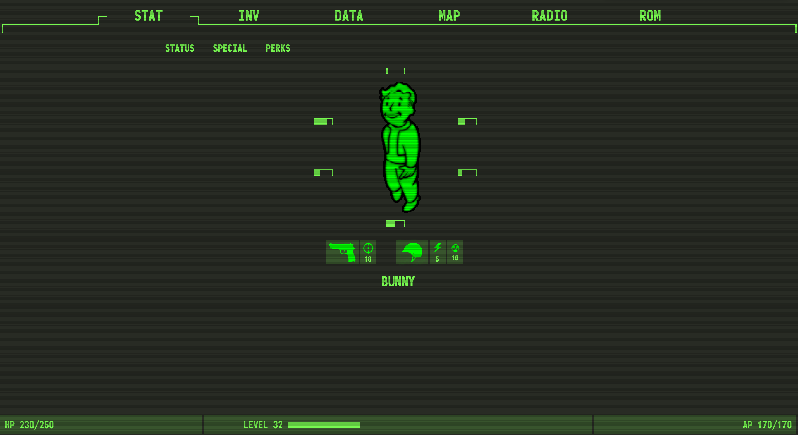
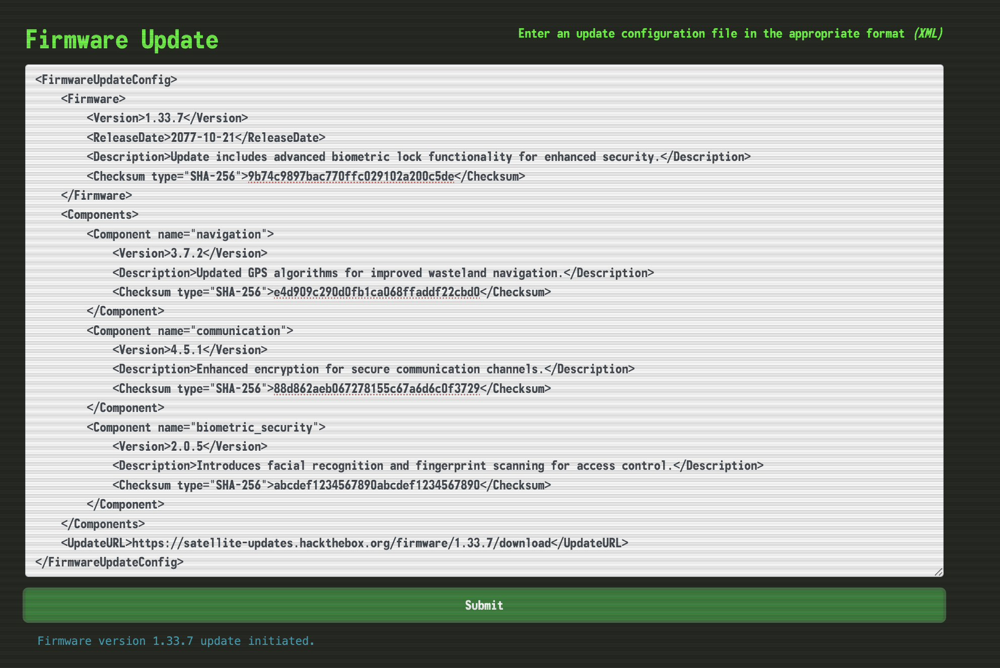
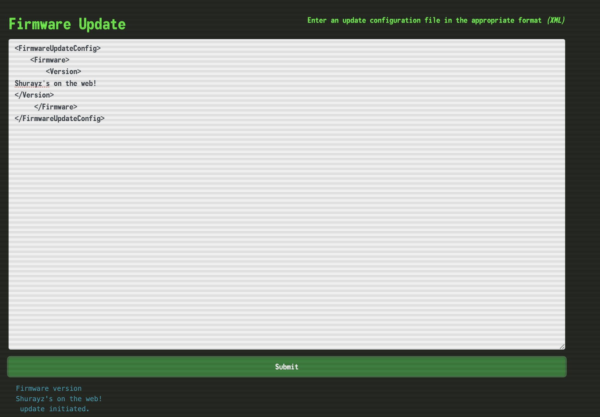
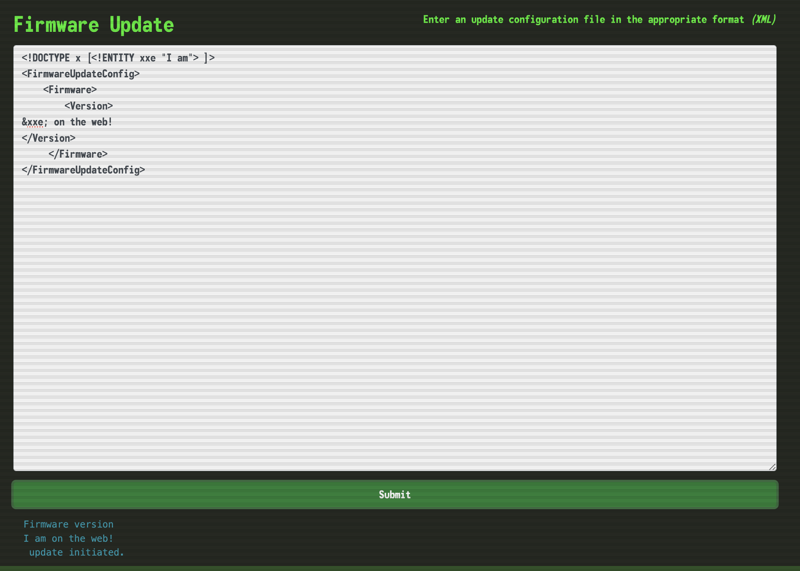
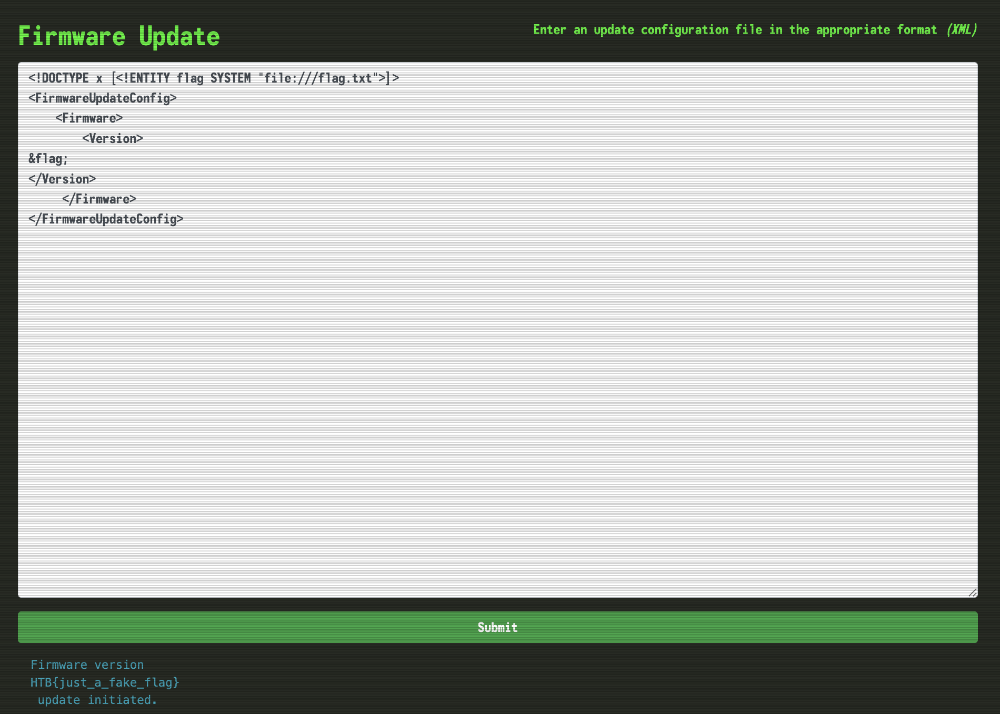

# Jailbreak

> ## Easy

### 1. Overview

The webpage looks very much like a game play! I visit with **`INV`**, **`DATA`**, ....

But only `/rom` has interactive with server by `xml` data. I send a `xml` to the server, which process data and response to me a input version.

I deleted everything and left only `Version` tag to test!

Yeah, it works. I think the core vector for `xml` is `xxe`, so in next section I try to test this vulnerability.

### 2. Enumeration

I think the server has a `xml` code: `<?xml version="1.0" ?>` as local, loads input and execute as `xml`. So I try to test with this payload: `<!DOCTYPE x [<!ENTITY> xxe "I am">]>`!

Yeah it works, now I exploit the server by this vector!

### 3. Exploitation

I guess the file most likely has name `/flag.txt` or `flag` or `/app/flag.txt`, ... First I try for `/flag.txt` with `<!DOCTYPE x [<!ENTITY flag SYSTEM "file:///flag.txt">]>`, which the simple core payload for xxe! 

Yeah, it works!

### 4. Root Cause
