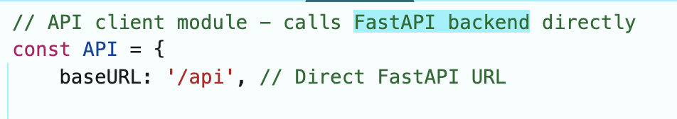
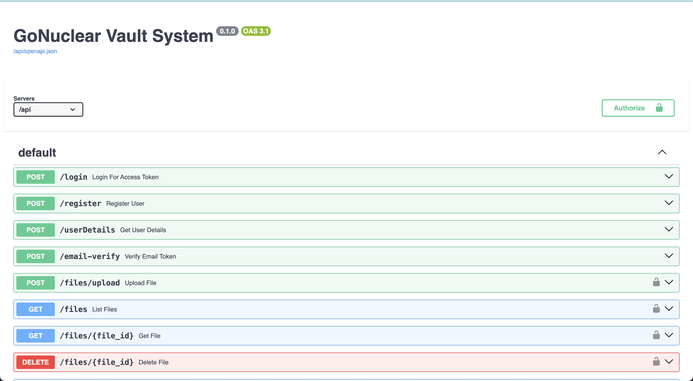
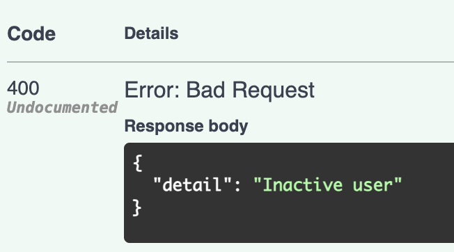
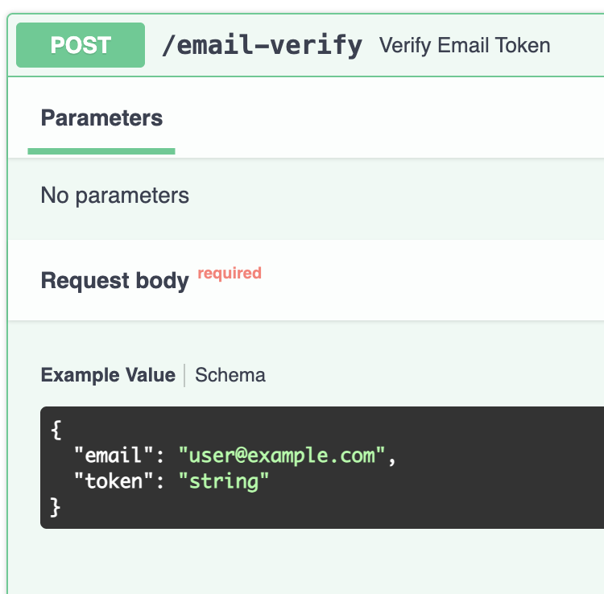
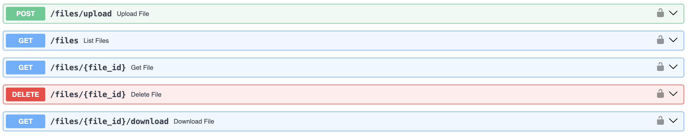
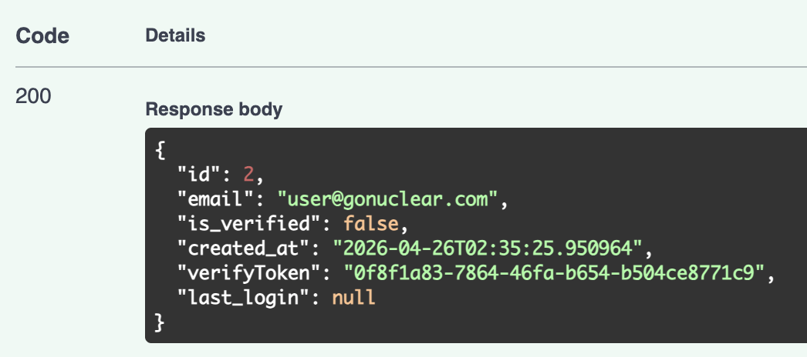
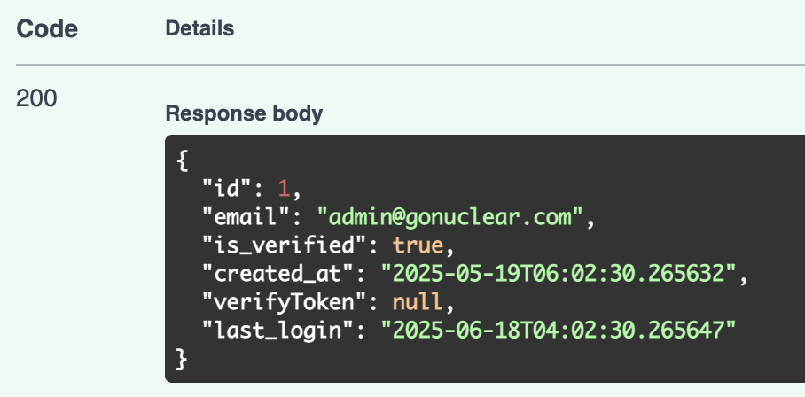
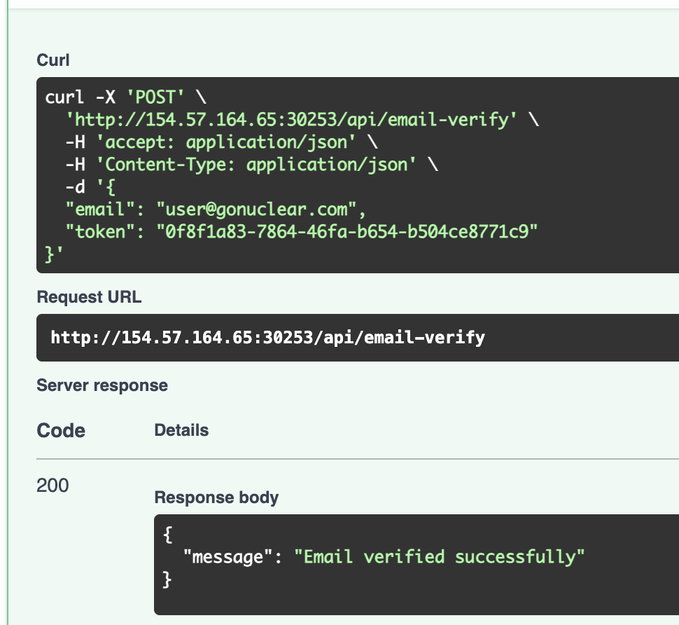
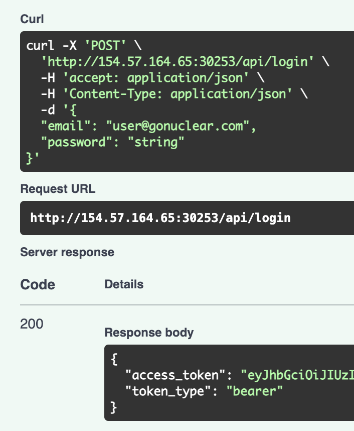
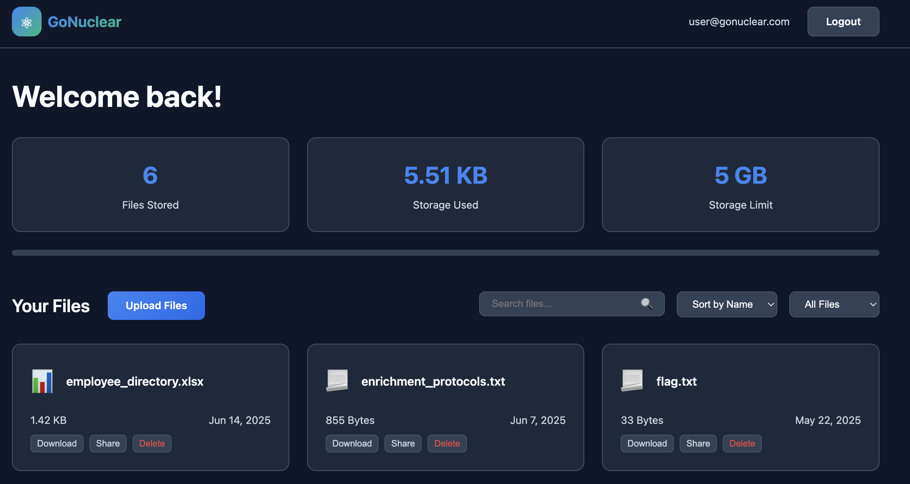

# NovaEnergy

> ## Easy

### 1. Overview

After walking through the webpage, all core feature I have seen are in `static/api.js` and `static/auth.js`. Looking for `api.js` source code, you can see **FastAPI backend**, which is used for this server backend. In **FastAPI backend**, it has a `docs` api for all api can use. I try for `/api/docs` and it is the endpoint api for `docs`!

I try to register, but only `@gonuclear.com` email can create account, and when I try to login, my account need to `active`. Reading `docs` and the `email-verify` is need for create and `active` account!

*Verify email need token*

File handling features are provided by server, I think attack vector can be file upload, but I need to login first!

### 2. Enumeration

After register, I don't think server have my `userDetail`, but I try for it and Boom!! It have my token for verify my email!

I try for admin email to get admin token, I think it can be useful sometime.

Wow, admin account doesn't have token, and no features have need it, only `email-verify`, so I think it not useful!!

### 3. Exploitation

Now, I try to exploit this logic vulnerability, I verify my account and login!

Login succesfull! I try to login page and dashboard page!!

Oh no! It has flag here! Download and read this!!

### 4. Root Cause   

