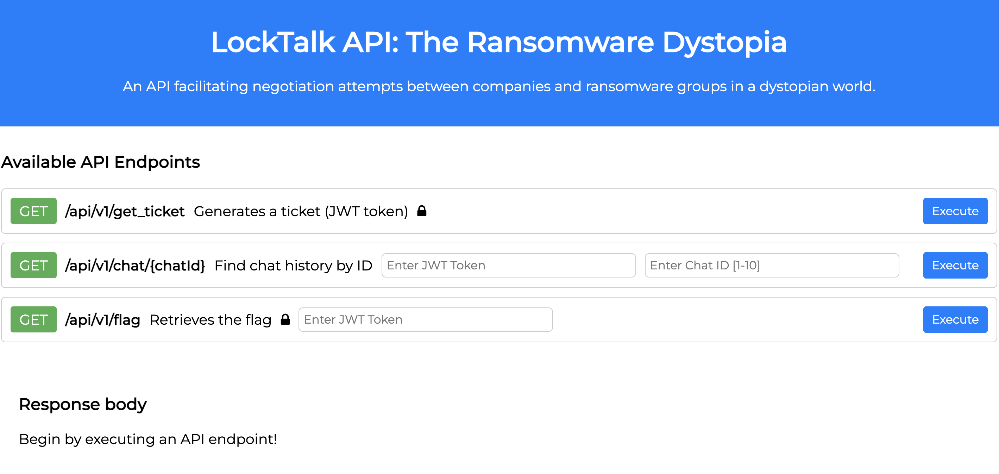
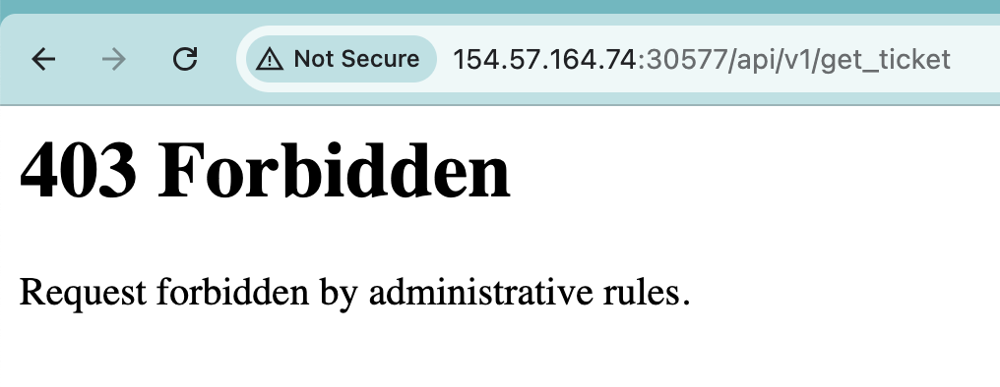
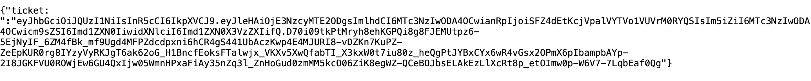
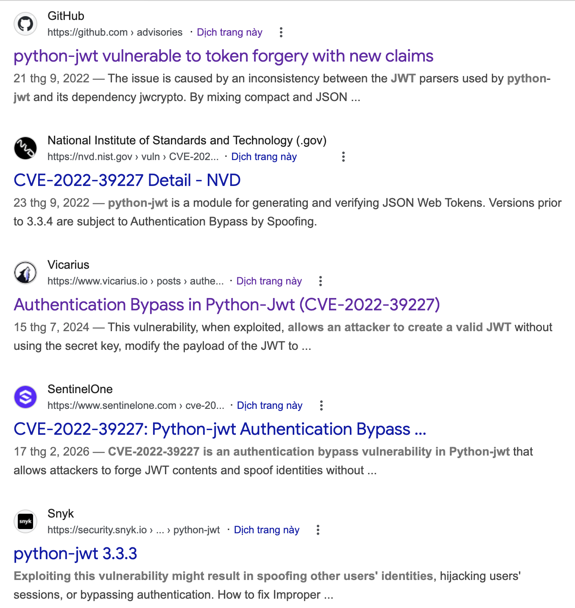
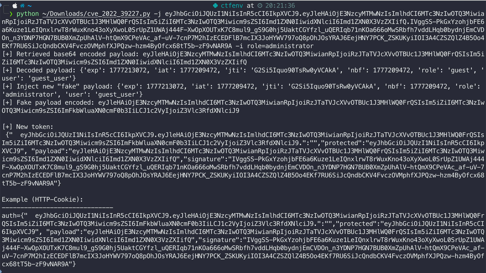
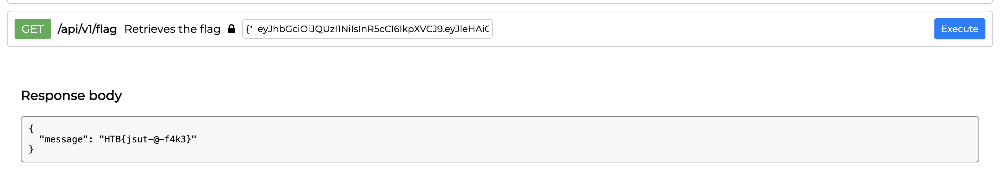

# LockTalk 

> ## Medium

### 1. Overview

The web page is very simple, only have a 3 api requests!

I try `get_ticket`, which is the only API I can use without JWT token! But the server rejects this request!

I read the source code to understand how do server reject my request. In `haproxy.cfg` file, the server rejects all request with extractly string `/api/v1/get_ticket`, so I search with key word `bypass path_beg` and find the [funny bypass](https://github.com/haproxy/haproxy/issues/2785) with `//` for `/`, yeah, this is the same for the web server, start with root direct page! So I try to request with `//api/v1/get_ticket`. Boom!! I have a token!!

### 2. Enumeration

Reading a source code, I can get flag if my token role is `administrator`. I think the core vector is `JWT` attack, I search about python-jwt vulnerabilities and I find it!

*python-jwt attack with CVE-2022-39227*

The root cause of this vulnerability is `python-jwt` process special token format and make this is correct token with old signature and custom data from user! Let reading the `requirements.txt` file, the version of `python-jwt` is `3.3.3`. Yeah, now we exploit it!

### 3. Exploitation

Now you can find the `PoC` code in Github or read some vulnerability analyst web page. I read [this page](https://www.vicarius.io/vsociety/posts/authentication-bypass-in-python-jwt-cve-2022-39227) and use this [source code](https://github.com/user0x1337/CVE-2022-39227/blob/main/cve_2022_39227.py)!

Making my admin token by PoC code!

This is very strange, I don't think token can have this format!! So I try for this and get flag!!

### 4. Root Cause

